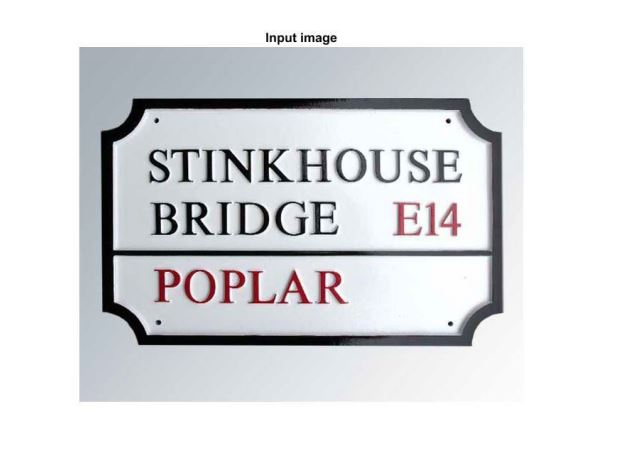
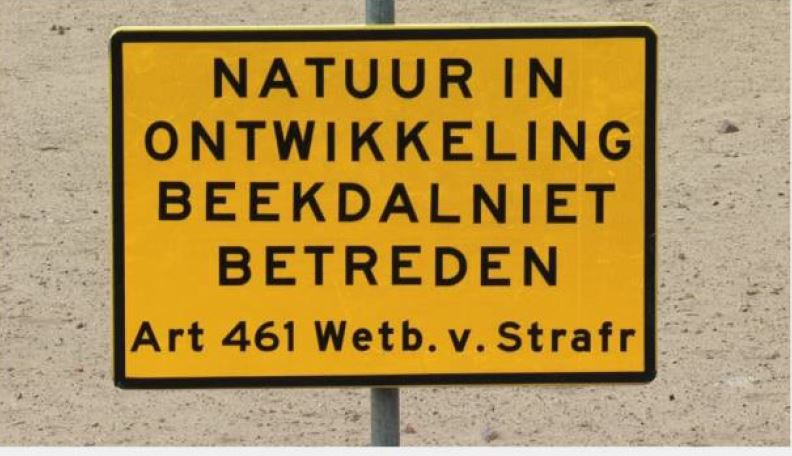
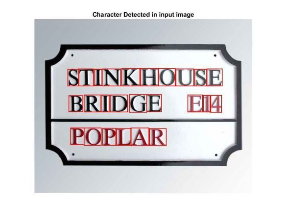
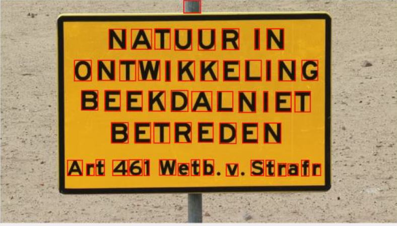

# OCR
 Optical Character Recognition
This repository contains the Matlab code for text detection and recognition for simpler images. I used the Chars74K dataset to train this  model.This project was developed during my undergard.

## Input

## Output

